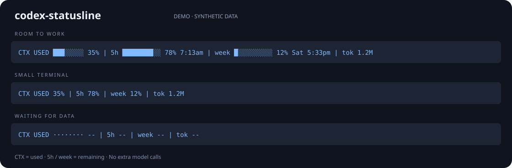

# codex-statusline

**See your Codex context and quota at a glance.**

[](https://github.com/Moviw/codex-statusline/actions/workflows/tests.yml)
[](https://pypi.org/project/codex-statusline/)
[](LICENSE)

English | [简体中文](README.zh-CN.md)

A status bar for [OpenAI Codex CLI](https://github.com/openai/codex). It shows context used, 5-hour and weekly quota left with reset times, and session tokens. You keep running `codex` exactly as before.



```text
CTX USED ███░░░░░ 35% | 5h ████████░░ 78% 5:41pm | week ████░░░░░░ 39% Fri 3:41pm | tok 1.2M
```

## Why

- **No more `/status` interruptions.** Quota and context sit in view while you work.
- **Local data only.** Never reads `auth.json`, never calls a quota API, never makes extra model calls. The one network request is a version check against PyPI when `codex` starts (turn off with `update_check = false`).
- **Zero new habits.** Keep typing `codex`. `codex exec`, pipes, and scripts pass straight through to the official binary.
- **Always current.** Quota is account-wide, so the freshest reading from any of your local Codex sessions is shown, and the bar flips to 100% the moment a window resets. Unknown shows as `--`, never a made-up number.
- **Fits any width.** Segments collapse, then drop, as the terminal narrows.

## Install

Requires macOS or Linux, [tmux](https://github.com/tmux/tmux), and Codex CLI ≥ 0.159.0. Bash, Zsh, and Fish are all detected automatically.

```sh
curl -fsSL https://raw.githubusercontent.com/Moviw/codex-statusline/main/install.sh | sh
```

The script installs [uv](https://docs.astral.sh/uv/) if needed (uv also fetches Python 3.11+ for you), installs the tool, then shows you the exact shell/hook diff and asks before writing anything.

Prefer to do it yourself:

```sh
uv tool install codex-statusline    # or: pipx install codex-statusline
codex-statusline install            # add --dry-run to only preview the diff
```

Then **open a new terminal** and run `codex`. The first time, Codex asks you to review a hook: confirm it is `codex-statusline binding`.

Missing tmux? `brew install tmux` or `sudo apt install tmux`.

## Usage

```sh
codex                     # same as always, now with a status bar
codex resume --last
codex exec 'task'         # non-interactive: passed straight through, no bar

codex-statusline config   # pick segments, theme and colors interactively
codex-statusline update   # upgrade, whichever way you installed it
codex-statusline doctor   # check versions and dependencies
codex-statusline preview --width 80   # try it without launching Codex
codex-statusline uninstall
```

Uninstall removes only what this tool added and still matches exactly. If you edited its block, it stops instead of overwriting. Backups live in `~/.local/share/codex-statusline/`.

## Configuration

Run `codex-statusline config` to set everything up in an interactive screen with a live preview: toggle and reorder segments, switch theme, set the warning thresholds, then press `s` to save.

```text
  [x] ctx     context used
  [x] 5h      5-hour quota
  [x] week    weekly quota
  [x] tokens  session tokens
> Theme            < auto >
  Quota yellow at  < 20% >
  Quota red at     < 5% >

Preview (sample numbers):
    CTX USED ███░░░░░ 35% | 5h ██░░░░░░░░ 18% 3:46pm | week ██████░░░░ 62% Sat 1:46pm | tok 1.2M
```

It writes `~/.config/codex-statusline/config.toml`, which you can also edit by hand:

```toml
segments = ["ctx", "5h", "week", "tokens"]  # pick and reorder
theme = "auto"     # auto (follow terminal) | dark | light
ascii = false      # true for terminals without block glyphs
warn_at = 20       # quota remaining % that turns yellow
crit_at = 5        # quota remaining % that turns red
update_check = true  # show "↑ new version" in the bar when one is out
```

Invalid values are reported and fall back to defaults.

## How it works

`codex` becomes a small shell function that starts the official CLI inside a private tmux session and draws the bar at the bottom. Data comes from two places only: the terminal title Codex already emits (model, context, thread id), and local Codex session logs: this session's log (pinned by exact path through a SessionStart hook) for context and tokens, plus the most recent local logs for account-wide quota. Only quota and token counters are read, never chat text. The official binary is not replaced or patched, and your tmux config is not touched. Details: [docs/architecture.md](docs/architecture.md).

## FAQ

**How do I scroll or copy?** Exactly as in plain Codex: the mouse wheel scrolls the conversation, and text selection works the same way.

**Windows?** Not supported (tmux).

**Is this official?** No. It is a third-party tool built on a version-sensitive integration.
