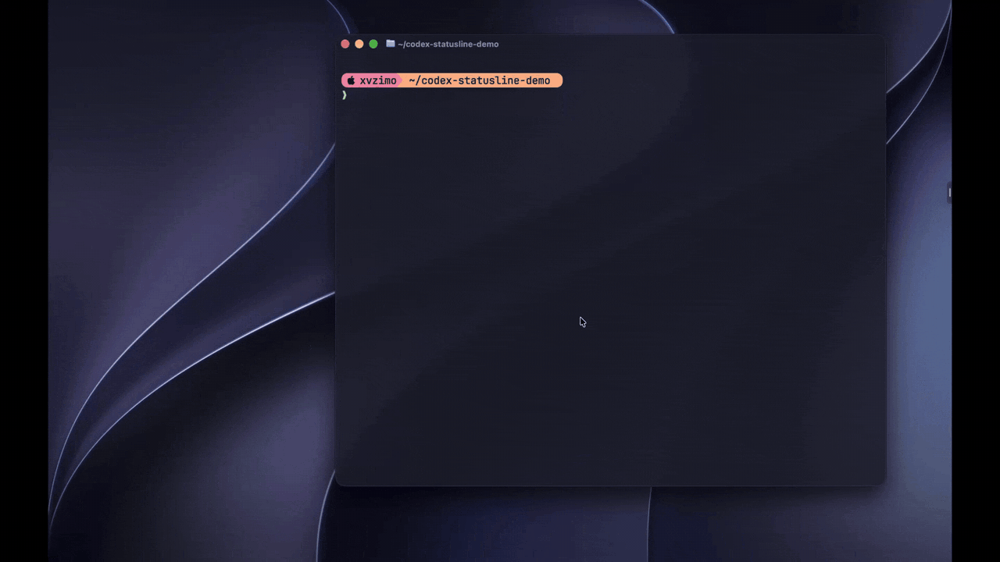

# codex-statusline

**一眼看清 Codex 的 context 和额度。**

[](https://github.com/Moviw/codex-statusline/actions/workflows/tests.yml)
[](https://pypi.org/project/codex-statusline/)
[](LICENSE)

[English](README.md) | 简体中文

给 [OpenAI Codex CLI](https://github.com/openai/codex) 加一条底栏：context 已用比例、5 小时和周额度剩余（含重置时间）、本次会话 token 数。命令照旧是 `codex`。



## 为什么用它

- **不用再敲 `/status`**：额度和 context 一直在眼前。
- **数据只在本地**：不读 `auth.json`、不访问额度 API、不额外调用模型。唯一的联网请求是启动 `codex` 时向 PyPI 查一次最新版本号（`update_check = false` 可关闭）。
- **零学习成本**：继续敲 `codex`；`codex exec`、管道、脚本原样交给官方 CLI。
- **始终最新**：额度是整个账号共用的，会取本机所有 Codex 会话里最新的读数；窗口一到重置时间就立刻显示 100%。未知显示 `--`，不会编造数字。
- **窄屏自适应**：终端变窄时先压缩、再逐段隐藏。

## 安装

需要 macOS 或 Linux、[tmux](https://github.com/tmux/tmux)，以及 Codex CLI 0.159.0 或更高版本。Bash、Zsh、Fish 自动检测。

```sh
curl -fsSL https://raw.githubusercontent.com/Moviw/codex-statusline/main/install.sh | sh
```

脚本会按需安装 [uv](https://docs.astral.sh/uv/)（uv 顺带解决 Python 3.11+，Ubuntu 22.04 也不用手动升级），然后安装本工具，先展示将要改动的 shell 与 hook 配置，确认后才写入。

想手动装：

```sh
uv tool install codex-statusline    # 或 pipx install codex-statusline
cxbar install                       # 加 --dry-run 先看会改什么
```

然后**打开一个新终端**运行 `codex`。第一次 Codex 会提示审核 hook，确认是 `codex-statusline binding` 即可。

没有 tmux？执行 `brew install tmux` 或 `sudo apt install tmux`。

## 使用

```sh
codex                     # 照常使用，多了底栏
codex resume --last
codex exec 'task'         # 非交互命令直接透传，不显示底栏

cxbar config              # 交互式选择显示段、主题和配色
cxbar update              # 升级（自动识别安装方式）
cxbar doctor              # 检查安装状态，有问题会给出修复命令
cxbar uninstall
```

`cxbar` 是 `codex-statusline` 的简写，两个命令完全等价。

卸载只移除本工具添加、且仍原样匹配的配置；如果你改过它的区块，会停止而不覆盖。备份在 `~/.local/share/codex-statusline/`。

## 配置

运行 `cxbar config`，在交互界面里一边预览一边配置：开关和排序显示段、切换主题、设置变色阈值，按 `s` 保存。

```text
  [x] ctx     context used
  [x] 5h      5-hour quota
  [x] week    weekly quota
  [x] tokens  session tokens
> Theme            < auto >
  Quota yellow at  < 20% >
  Quota red at     < 5% >

Preview (sample numbers):
    CTX USED ███░░░░░ 35% | 5h ██░░░░░░░░ 18% 3:46pm | week ██████░░░░ 62% Sat 1:46pm | tok 1.2M
```

配置保存在 `~/.config/codex-statusline/config.toml`，也可以直接手动编辑：

```toml
segments = ["ctx", "5h", "week", "tokens"]  # 选择与排序
theme = "auto"     # auto（跟随终端）| dark | light
ascii = false      # 终端不支持方块字符时设为 true
warn_at = 20       # 额度剩余低于该百分比变黄
crit_at = 5        # 额度剩余低于该百分比变红
update_check = true  # 有新版本时在底栏显示 "↑ 新版本号"
```

非法值会提示并回退到默认值。

## 原理

`codex` 会变成一个小 shell 函数：它在私有 tmux session 里启动官方 CLI，并在底部绘制状态栏。数据只有两个来源：Codex 自己发出的终端标题（模型、context、thread id），以及本机的 Codex 会话日志：context 和 token 数只读由 SessionStart hook 按精确路径绑定的**本次**会话日志，账号共用的额度则取最近几个本地会话日志里最新的一条。只读取额度和 token 计数，从不读聊天内容。不替换、不修改官方二进制，也不改你的 tmux 配置。详见[架构说明](docs/architecture.md)。

## 常见问题

**怎么滚动或复制？** 和直接运行 Codex 完全一样：鼠标滚轮滚动对话，选中复制文字的方式也不变。

**支持 Windows 吗？** 不支持（依赖 tmux）。

**是官方的吗？** 不是。这是第三方工具，依赖版本敏感的集成方式。
